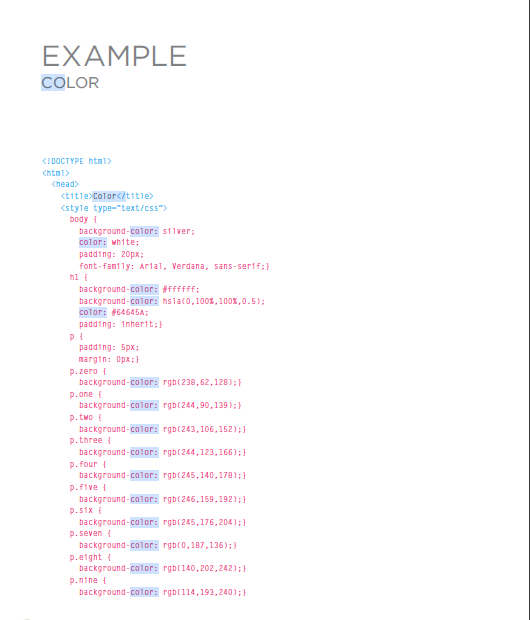
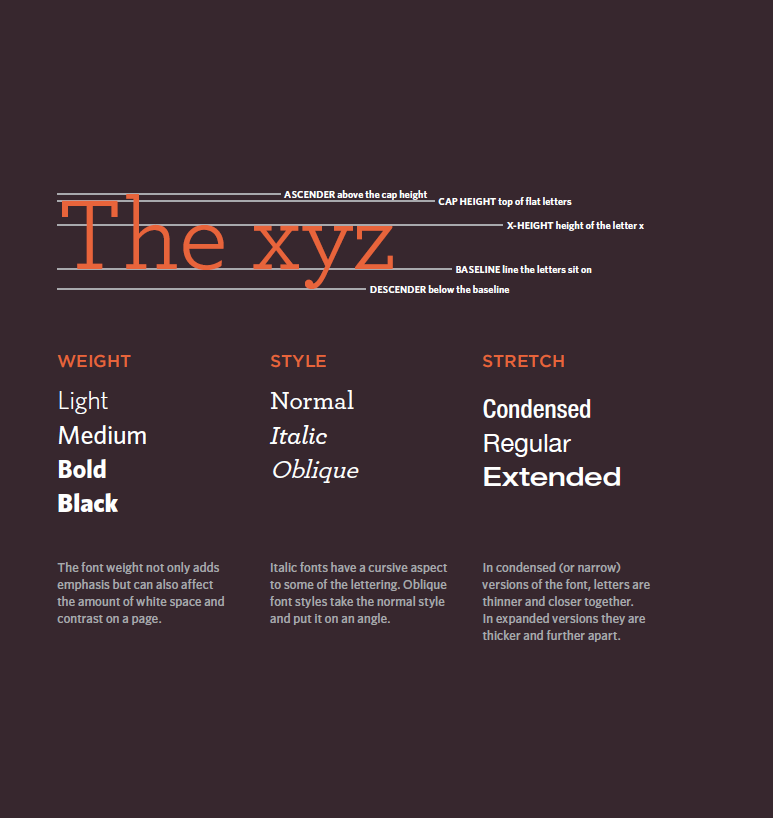

# Images

A picture can say a thousand words, and great images help make the difference between an
average-looking site and a really engaging one.

Images can be used to set the tone for a site in less time than it takes to read a description.
If you do not have photographs to use on your website, there are companies who sell stock images; these are images you To add an image into the page you need to use an img element.
 This is an empty element (which means there is no closing tag).
  It must carry the following two attributes:

- You can also use the title attribute with the img element to provide additional information about the image.
- Most browsers will display the content of this attribute in a tootip when the user hovers over the image.

# Summary

- The img element is used to add images to a
web page.
- You must always specify a src attribute to indicate the
source of an image and an alt attribute to describe the
content of an image.
- You should save images at the size you will be using
them on the web page and in the appropriate format.
- Photographs are best saved as JPEGs; illustrations or
logos that use flat colors are better saved as GIFs.

# Color

Color can really bring your pages to life.

The color property allows you to specify the color of text inside an element.
You can specify any color in CSS in one of three ways;

- color names
- There are 147 predefined color names that are recognized by browsers. For example:

- DarkCyan

## windows have a white background, but browser users can set a background color for their windows, so if you want to be sure that the background is white you can use the background-color property on the body element

# Summary

- Color not only brings your site to life, but also helps convey the mood and evokes reactions.
### There are three ways to specify colors in CSS:
- RGB values, hex codes, and color names.
- Color pickers can help you find the color you want.
- It is important to ensure that there is enough contrast between any text and the background color (otherwise people will not be able to read your content).
- CSS3 has introduced an extra value for RGB colors to indicate opacity. It is known as RGBA.
- CSS3 also allows you to specify colors as HSL values,
- with an optional opacity value. It is known as HSLA.

# Text

## The properties that allow you to control the appearance of text can be split into two groups:
- Those that directly affect the font and its appearance
(including the typeface, whether it is regular, bold or italic,
and the size of the text)
- Those that would have the same effect on text no matter
what font you were using (including the color of text and
the spacing between words and letters)

## If you want to create italic text,
you can use the font-style
property. There are three values
this property can take:
- normal
- italic
- oblique
# Summary

## There are properties to control the choice of font, size, weight, style, and spacing.
### There is a limited choice of fonts that you can assume most people will have installed.
### If you want to use a wider range of typefaces there are several options, but you need to have the right license to use them.
### You can control the space between lines of text, individual letters, and words. Text can also be aligned to the left, right, enter, or justified. It can also be indented.
### You can use pseudo-classes to change the style of an element when a user hovers over or clicks on text, or when they have visited a link.

