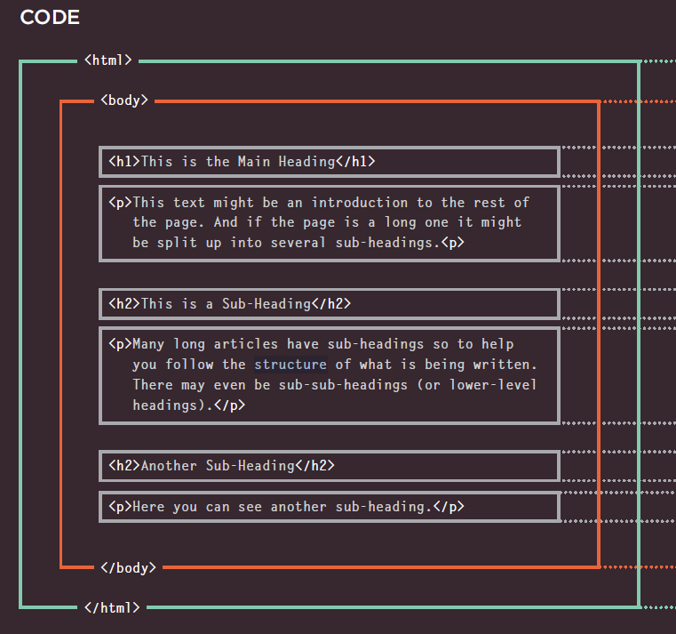

# Structure
- In all kinds of documents, structure is very important in helping
readers to understand the messages you are trying to convey
and to navigate around the document

- The use of headings and subheadings in any document often reflects a hierarchy of information. For example, a document might start with a large heading, followed by an introduction or the most important information.

- The HTML code (in blue) is made up of characters that live inside angled
brackets — these are called HTML elements.

- Each HTML element tells the browser
something about the information that sits between its opening and
closing tags.

* HTML pages are text documents
* Attributes require a name and a value
* To learn HTML you need to know what tags are
* available for you to use, what they do, and where they can go.

# Extra Markup
- DOCTYPES tell browsers which version of HTML you are using.
- You can add comments to your code between the <!-- and --> markers.
- The id and class attributes allow you to identify particular elements.
- The 
 and  elements allow you to group block-level and inline elements together.
- <iframes> cut windows into your web pages through which other pages can be displayed.
- The <meta> tag allows you to supply all kinds of information about your web page.
- Escape characters are used to include special characters in your pages such as <, >, and ©.

# HTML5 Layout

The header and footer elements can be used for..

* The main header or footer that appears at the top or bottom of every page on the site.

* A header or footer for an individual article or section within the page.

* The nav element is used to contain the major navigational blocks on the site such as the primary site navigation.

* The article element acts as a container for any section of a page that could stand alone and potentially be syndicated.

* The aside element has two purposes, depending on whether it is inside an article element or not.

# Process & Design

- It's important to understand who your target audience is, why they would come to your site, what information they want to find and when they are likely to return.
- Site maps allow you to plan the structure of a site.
- Wireframes allow you to organize the information that will need to go on each page.
- Design is about communication.
- Visual hierarchy helps visitors understand what you are trying to tell them.
- You can differentiate between pieces of information using size, color, and style.
- You can use grouping and similarity to help simplify the information you present.

# The ABC of Programming
## A
- A script is a series of instructions that the computer can follow in order to achieve a goal.
- Each time the script runs, it might only use a subset of all the instructions.
- Computers approach tasks in a different way than humans, so your instructions must let the computer solve the task prggrammatically.
- To approach writing a script, break down your goal into a series of tasks and then work out each step needed to complete that task (a flowchart can help).

## B

## C

- It is best to keep JavaScript code in its own JavaScript file.
- JavaScript files are text files (like HTML pages and CSS style sheets), but they have the . j s extension.
- The HTML script element is used in HTML pages to tell the browser to load the JavaScript file (rather like
the link element can be used to load a CSS file).
- If you view the source code of the page in the browser, the JavaScript will not have changed the HTML, because the script works with the model of the web page that the browser has created.

