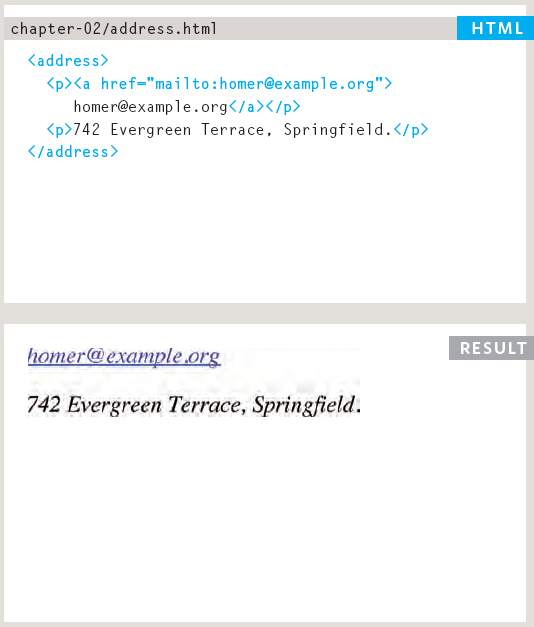
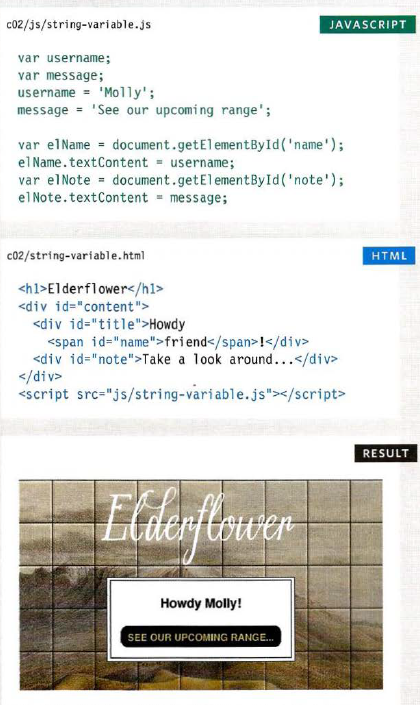

# text

- Structural markup: the elements that you can use to
describe both headings and paragraphs Semantic markup: which provides extra information; such as where emphasis is placed in a sentence, that something you have written is a quotation (and who said it), the meaning of acronyms, and so on

- HTML elements are used to describe the structure of the page (e.g. headings, subheadings, paragraphs).
They also provide semantic information (e.g. where emphasis should be placed, the definition of any acronyms used, when given text is a quotation).
## example

# Introducing CSS

### CSS allows you to create rules that specify how the content of an element should appear. For example, you can specify that the background of the page is cream, all paragraphs should appear in gray using the Arial typeface, or that all level one headings should be in a blue, italic, Times typeface.

- CSS treats each HTML element as if it appears inside its own box and uses rules to indicate how that element should look.
- Rules are made up of selectors (that specify the elements the rule applies to) and declarations (that indicate what these elements should look like).
- Different types of selectors allow you to target your rules at different elements.
- Declarations are made up of two parts: the properties of the element that you want to change, and the values of those properties.
##### For example, the font-family property sets the choice of font, and the value arial specifies Arial as the preferred typeface.
- CSS rules usually appear in a separate document, although they may appear within an HTML page.

# Basic JavaScript Instructions

- A script is a series of instructions that a computer can follow one-by-one.
- Each individual instruction or step is known as a statement.
- Statements should end with a semicolon.
- You should write comments to explain what your code does.
1. They help make your code easier to read and understand.
2. This can help you and others who read your code.

- A script will have to temporarily store the bits of information it needs to do its job. It can store this data in variables.
## example to USING A VARIABLE TO STORE A STRING

- A script is made up of a series of statements.
- Each statement is like a step in a recipe.
- Scripts contain very precise instructions. For example, you might specify that a value must be remembered before creating a calculation using that value.
- Variables are used to temporarily store pieces of information used in the script.
- Arrays are special types of variables that store more than one piece of related information.
- JavaScript distinguishes between numbers (0-9), strings (text), and Boolean values (true or false).
- Expressions evaluate into a single value.
- Expressions rely on operators to calculate a value.

# Decisions and Loops

## A switch statement starts with a variable called the switch value.
Each case indicates a possible value for this variable and the code that should run if the variable matches that value.

### JavaScript can convert data types behind the scenes to complete an operation. This is known as type coercion.
- For example, a string 'l ' could be converted to a number 1 in the following expression:(' 1' > 0).
As a result, the above expression would evaluate to true.

### JavaScript is said to use weak typing because the data type for a value can change.
Some other languages require that you specify what data type each variable will be.
They are said to use strong typing.

### Logical operators are processed left to right.
They short-circuit (stop) as soon as they have a result - but they return the value that stopped the processing (not necessarily true or fa 1 se).

# end

