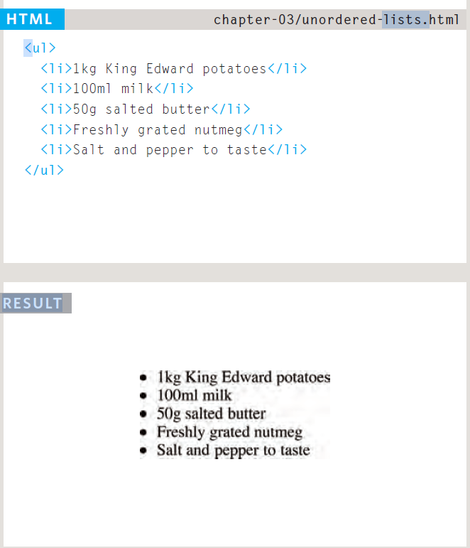

# lists
## What is ordered lists
Ordered lists are lists where each item in the list is numbered.
For example, the list might be a set of steps for a recipe that must be performed in order, or a legal contract where each point needs to be identified by a section 

### orderd list ex

## Unordered lists are lists that begin with a bullet point (rather than characters that indicate order).
Each item in the list is placed between an opening li tag and a closing li tag. (The li stands for list item.)

## Definition lists are made up of a set of terms along with the definitions for each of those terms.
The definition list is created with the dl element and usually consists of a series of terms and their definitions.
Inside the dl element you will usually see pairs of dt and dd elements.

## SMURRY
**There are three types of HTML lists: ordered, unordered, and definition.**
- Ordered lists use numbers.
- Unordered lists use bullets.
- Definition lists are used to define terminology.
- Lists can be nested inside one another.

# Boxes
*HOW* The most popular ways to specify the size of a box are to use pixels, percentages, or ems. Traditionally, pixels have been the most popular method because they allow designers to accurately control their size.
*Some page designs* expand andshrink to fit the size of the user's screen. In such designs, the min-width property specifies the smallest size a box can be displayed at when the browser window is narrow, and the max-width property indicates the maximum width a box can stretch to when the browser window is wide.

## SUMRRY
CSS treats each HTML element as if it has its own box.
- You can use CSS to control the dimensions of a box.
- You can also control the borders, margin and padding for each box with CSS.
- It is possible to hide elements using the display and visibility properties.
- Block-level boxes can be made into inline boxes, and inline boxes made into block-level boxes.
- Legibility can be improved by controlling the width of boxes containing text and the leading.
- CSS3 has introduced the ability to create image borders and rounded borders.

# Basic JavaScript Instructions
## An array is a special type of variable. It doesn't just store one value; it stores a list of values.
-This technique for creating an array is known as an array literal.
-It is usually the preferred method for creating an array.
-You can also write each value on a separate line.
## Values in an array are accessed as if they are in a numbered list. It is important to know that the numbering of this list starts at zero (not one).

