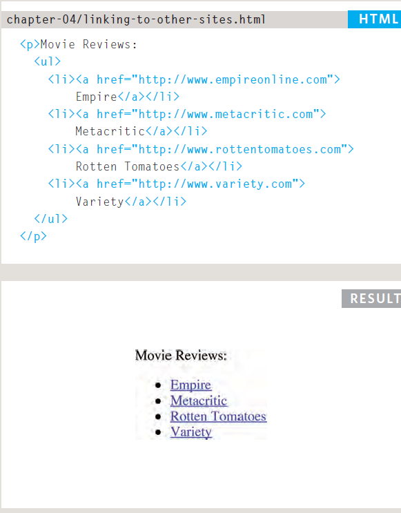
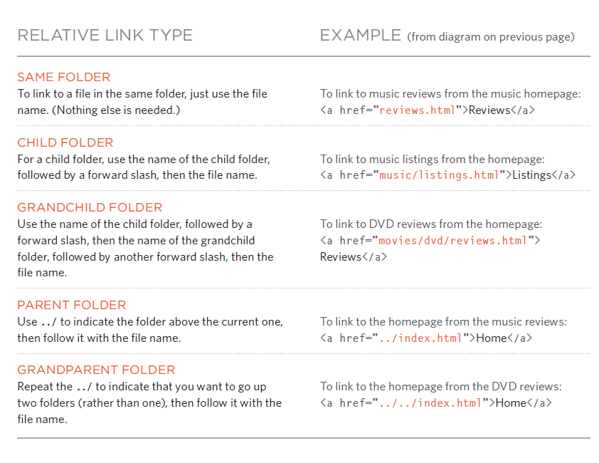
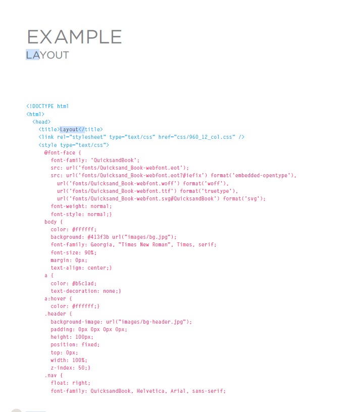

# what is links?
## Links are the defining feature of the web because they allow you to move from one web page to another — enabling the very idea of browsing or surfing.

# what is types of links?

- Links from one website to another
- Links from one page to another on the same website
- Links from one part of a web page to another part of the same page
- Links that open in a new browser window
- Links that start up your email program and address a new email to someone

# how to Writing Links?

- Links are created using the a element. Users can click on anything between the opening a tag and the closing a tag. You specify which page you want to link to using the href attribute.

- Links are created using the a element which has an attribute called href.
- The value of the href attribute is the page that you want people to go to when they click on the link

# summry 
1. Links are created using the a element.
2. The a element uses the href attribute to indicate the page you are linking to.
3. If you are linking to a page within your own site, it is best to use relative links rather than qualified URLs.
4. You can create links to open email programs with an email address in the "to" field.
5. You can use the id attribute to target elements within a page that can be linked to.

# Layout
## how we can use Layout?
- Controlling the position of elements
- Creating site layouts
- Designing for different sized screens
- Building Blocks
- Containing Elements
- Controll ing the Position of Elements
- Floating Elements
### To indicate where a box should be positioned, you may also need to use box offset properties to tell the browser how far from the top or bottom and left or right it should be placed. 

# Summary Layout

- div elements are often used as containing elements to group together sections of a page.
- Browsers display pages in normal flow unless you specify relative, absolute, or fixed positioning.
- The float property moves content to the left or right of the page and can be used to create multi-column layouts. (Floated items require a defined width.)
- Pages can be fixed width or liquid (stretchy) layouts.
- Designers keep pages within 960-1000 pixels wide, and indicate what the site is about within the top 600 pixels (to demonstrate its relevance without scrolling).
- Grids help create professional and flexible designs.
- CSS Frameworks provide rules for common tasks.
- You can include multiple CSS files in one page.

